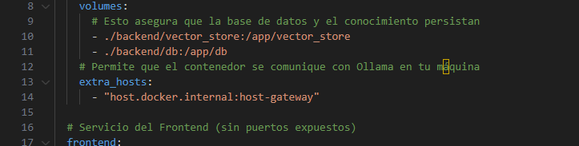
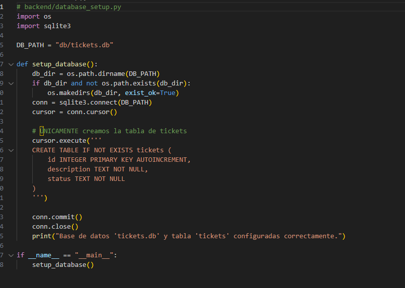
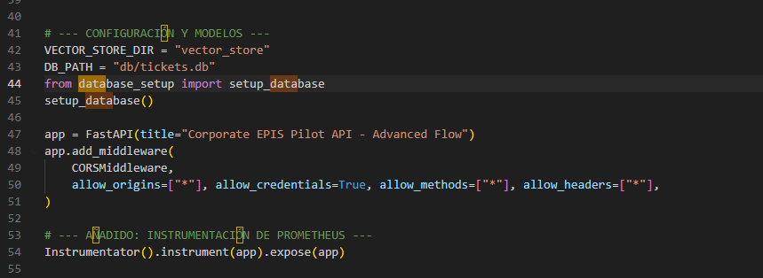
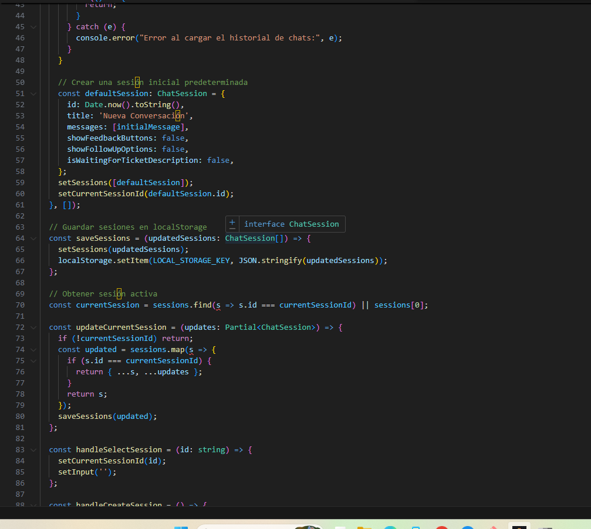
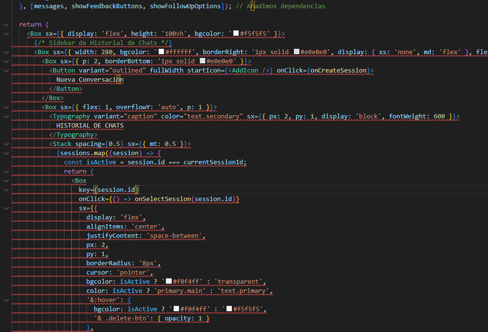
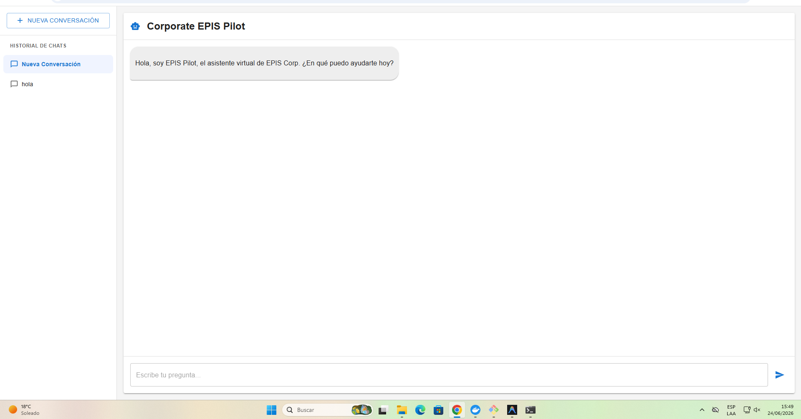

# PLAN DE AUDITORÍA - SISTEMA CORPORATE EPIS PILOT

**Auditor Encargado:** Quispe  
**Repositorio del Proyecto:** [-AUDITORIA_EXAMEN_3_QUISPE](https://github.com/toallin/-AUDITORIA_EXAMEN_3_QUISPE.git)  
**Fecha:** 24 de Junio de 2026  

---

## 1. OBJETIVO GENERAL

* **Evaluar la resiliencia en la persistencia de datos, la configuración del despliegue en contenedores Docker y la usabilidad de la interfaz de usuario en el sistema de asistencia virtual "Corporate EPIS Pilot", aplicando correcciones técnicas necesarias para garantizar la integridad operativa y la continuidad del historial de conversaciones.**

## 2. OBJETIVOS ESPECÍFICOS 

1. **Auditar y corregir la configuración del volumen de base de datos en Docker Compose**, eliminando los fallos de inicialización y montaje cruzado en Windows causados por la asignación directa de archivos inexistentes en el host.
2. **Reestructurar la inicialización dinámica de la base de datos SQLite (tickets.db)**, asegurando la existencia automática del directorio de base de datos a nivel de backend tanto en la fase de compilación como en tiempo de ejecución de los contenedores.
3. **Analizar la usabilidad del panel lateral del frontend y habilitar la persistencia del historial de chats**, sustituyendo el mensaje estático de omisión por un sistema local basado en `localStorage` capaz de almacenar, seleccionar y eliminar conversaciones individuales.
4. **Validar el flujo de comunicaciones internas en la arquitectura de contenedores**, garantizando la correcta resolución de peticiones a través de Nginx y la comunicación fluida del backend hacia servicios de inteligencia artificial locales.

---

## 3. RESUMEN DE CORRECCIONES EN EL CÓDIGO

### A. Configuración de Volúmenes en Docker Compose
* **Archivo:** [docker-compose.yml](file:///c:/Users/HP/Downloads/123123/-AUDITORIA_EXAMEN_3_QUISPE/docker-compose.yml)
* **Corrección:** Se cambió el montaje directo del archivo `./backend/tickets.db:/app/tickets.db` por el montaje de la carpeta `./backend/db:/app/db`.
* **Evidencia:**anexo A

### B. Inicialización Dinámica de la Base de Datos
* **Archivo:** [backend/database_setup.py](file:///c:/Users/HP/Downloads/123123/-AUDITORIA_EXAMEN_3_QUISPE/backend/database_setup.py)
* **Corrección:** Se actualizó `DB_PATH = "db/tickets.db"` y se agregó la librería `os` para validar y crear el directorio mediante `os.makedirs(db_dir, exist_ok=True)` antes de conectar SQLite.
* **Evidencia:**anexo b

* **Archivo:** [backend/main.py](file:///c:/Users/HP/Downloads/123123/-AUDITORIA_EXAMEN_3_QUISPE/backend/main.py)
* **Corrección:** Se actualizó `DB_PATH = "db/tickets.db"` y se importó `setup_database` para ejecutarlo inmediatamente al inicializar el 
* **Evidencia:**anexo b2

### C. Persistencia Local del Historial de Chats en Frontend
* **Archivo:** [frontend/src/App.tsx](file:///c:/Users/HP/Downloads/123123/-AUDITORIA_EXAMEN_3_QUISPE/frontend/src/App.tsx)
* **Corrección:** Se reemplazó el estado simple de mensajes individuales por una estructura de sesiones (`ChatSession[]`) guardadas de forma persistente en `localStorage`. Se programaron funciones de añadir, borrar e interactuar con cada chat.
 **Evidencia:**anexo c

* **Archivo:** [frontend/src/components/ChatLayout.tsx](file:///c:/Users/HP/Downloads/123123/-AUDITORIA_EXAMEN_3_QUISPE/frontend/src/components/ChatLayout.tsx)
* **Corrección:** Se eliminó el texto estático *"El historial de chats se ha omitido en esta versión."* y se sustituyó por una barra lateral dinámica que recorre las sesiones guardadas, permitiendo al usuario cambiar de conversación o eliminarlas a voluntad.
 **Evidencia:**anexo c2
---

## 4. ANEXOS 

### Anexo a: Solución al Error de Montaje en Docker Compose
*Aquí se muestra la terminal con la correcta ejecución de `docker-compose up --build` después de cambiar el volumen:*  

### Anexo b: Creación Dinámica del Directorio de Base de Datos
*Aquí se muestra la lógica aplicada en `database_setup.py` y `main.py` para levantar SQLite:*  

### Anexo b2: Creación Dinámica del Directorio de Base de Datos
*Aquí se muestra la lógica aplicada en `database_setup.py` y `main.py` para levantar SQLite:*  

### Anexo c: Visualización del Historial de Chats en Funcionamiento
*Aquí se muestra la barra lateral del Frontend mostrando múltiples chats y la opción de borrarlos:*  

### Anexo c2: Persistencia tras la Recarga de la Página
*Aquí se evidencia cómo al recargar la página Web, los chats almacenados se cargan correctamente de `localStorage`:*  

## 5. pagina funcional

### vista del pagina funcionando
*Aquí se muestra la pagina funcionando al 100%

---

# INFORME FINAL DE AUDITORÍA DE SISTEMAS

## CARÁTULA
* **Entidad Auditada:** [Nombre de la entidad o dependencia]
* **Ubicación:** [tacna, tacna, tacna, tacna]
* **Período auditado:** [Desde 24/06/2026 hasta 24/06/2026 ]
* **Equipo Auditor:** [cristian aldair quispe levano]
* **Fecha del informe:** [24/06/2026 ]

---

## ÍNDICE
1. [Resumen Ejecutivo](#1-resumen-ejecutivo)
2. [Antecedentes](#2-antecedentes)
3. [Objetivos de la Auditoría](#3-objetivos-de-la-auditoría)
4. [Alcance de la Auditoría](#4-alcance-de-la-auditoría)
5. [Normativa y Criterios de Evaluación](#5-normativa-y-criterios-de-evaluación)
6. [Metodología y Enfoque](#6-metodología-y-enfoque)
7. [Hallazgos y Observaciones](#7-hallazgos-y-observaciones)
8. [Análisis de Riesgos](#8-análisis-de-riesgos)
9. [Recomendaciones](#9-recomendaciones)
10. [Conclusiones](#10-conclusiones)
11. [Plan de Acción y Seguimiento](#11-plan-de-acción-y-seguimiento)
12. [Anexos](#12-anexos)

---

